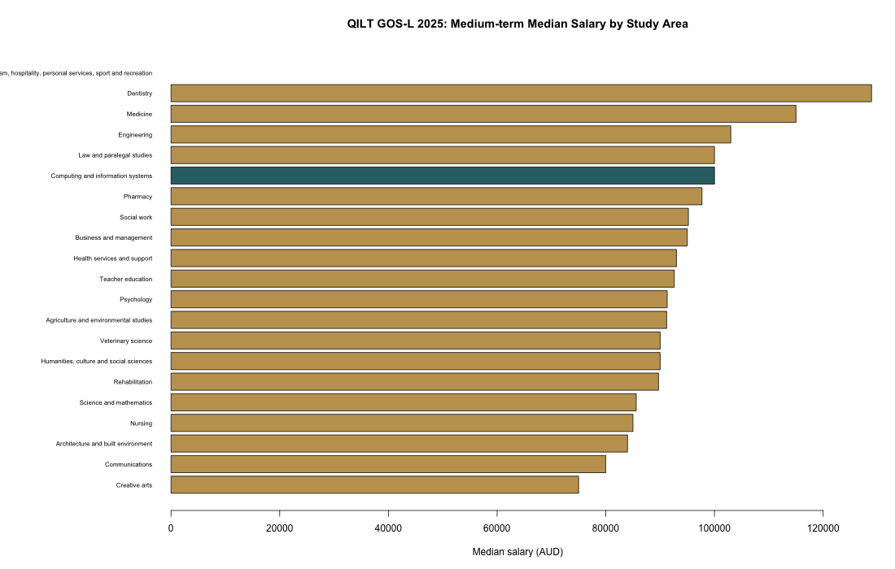
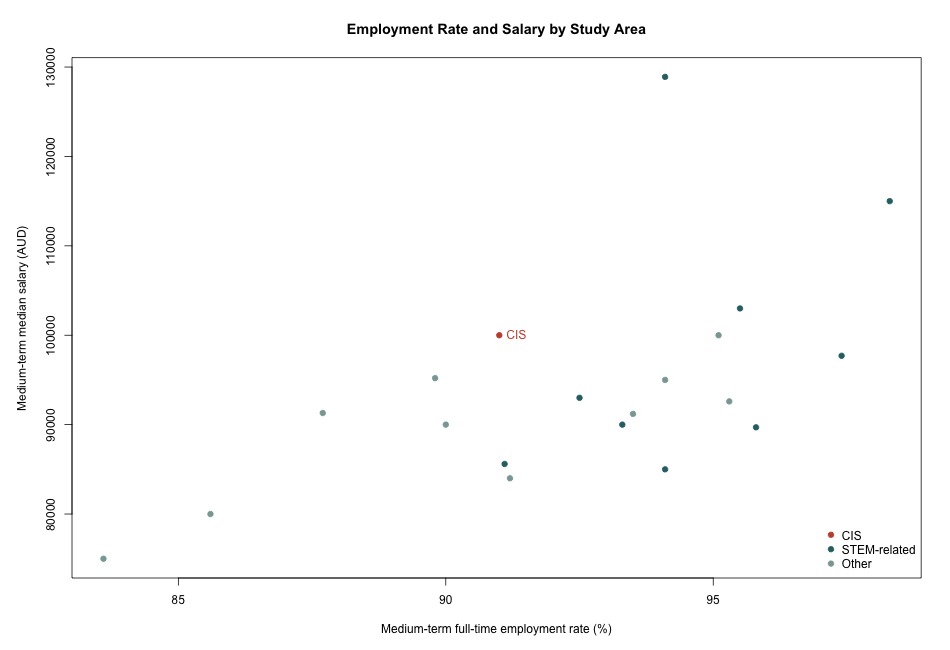
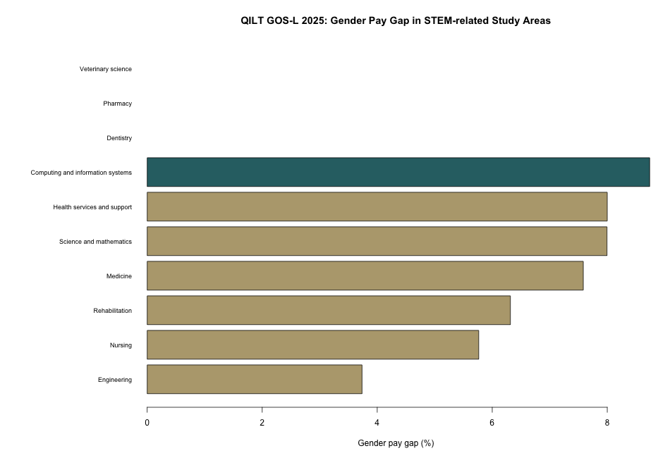

# Australian Graduate Employment Outcomes Analysis

基于 QILT Graduate Outcomes Survey - Longitudinal (GOS-L) 2025 官方公开数据，分析澳洲毕业生就业率、薪资中位数、薪资增长和性别薪资差距，并重点关注 Computing and Information Systems (CIS) 专业毕业生表现。

这个项目定位为一个 **Data Analyst Portfolio Project**，展示从真实公开数据获取、Excel 多表提取、数据清洗、特征工程、可视化、探索性建模到 HTML 报告输出的完整流程。

## Project Highlights

- 使用 QILT 官方公开数据，而不是模拟数据
- 使用 Python 从多 sheet Excel 报告中提取整洁 CSV
- 使用 R 完成数据清洗、特征工程、可视化和建模
- 输出可复现 HTML 报告和分析图表
- 聚焦业务问题：就业表现、薪资结果、性别薪资差距、大学层面差异

## Key Findings

根据 QILT GOS-L 2025 公开汇总数据：

| Metric | CIS Result |
|---|---:|
| Medium-term full-time employment rate | 91.0% |
| Medium-term overall employment rate | 92.0% |
| Medium-term median salary | AUD 100,000 |
| Short-term median salary | AUD 69,100 |
| Salary growth from short-term to medium-term | AUD 30,900 |
| Male medium-term median salary | AUD 103,000 |
| Female medium-term median salary | AUD 94,000 |
| CIS gender pay gap | 8.7% |

## Business Questions

1. How do CIS graduates compare with other study areas in medium-term employment and salary outcomes?
2. Does CIS show a visible gender pay gap compared with other STEM-related fields?
3. Which universities report stronger medium-term employment and salary outcomes?
4. What employment and salary indicators are most associated with medium-term salary outcomes?

## Data Source

- Dataset: Graduate Outcomes Survey - Longitudinal (GOS-L) 2025 National Report Tables
- Publisher: Quality Indicators for Learning and Teaching (QILT)
- Official page: https://qilt.edu.au/surveys/graduate-outcomes-survey---longitudinal-%28gos-l%29
- Source workbook: `GOSL_2025_National_Tables_Public.xlsx`

QILT GOS-L reports graduate outcomes around three years after course completion. The public workbook contains aggregated report tables, including employment rates, salaries, study areas, gender breakdowns, and university-level outcomes.

## Tools Used

- Python: extract selected sheets from QILT Excel workbook
- openpyxl: Excel workbook parsing
- R: data cleaning, analysis, modelling, charts
- rpart: decision tree model
- stats: linear regression model
- rmarkdown / knitr: HTML report generation
- Git / GitHub: version control and portfolio publishing

## Project Structure

```text
.
├── README.md
├── run_analysis.R
├── R
│   ├── 00_generate_sample_data.R
│   ├── 01_clean_data.R
│   ├── 02_feature_engineering.R
│   └── 03_modeling.R
├── scripts
│   └── extract_qilt_gosl_2025.py
├── docs
│   ├── data_sources.md
│   ├── data_dictionary.md
│   ├── executive_summary.md
│   └── methodology.md
├── reports
│   ├── australia_graduate_employment_report.Rmd
│   └── australia_graduate_employment_report.html
├── data
│   ├── raw
│   └── processed
└── outputs
    ├── figures
    ├── models
    └── tables
```

## How to Run

If the extracted QILT CSV files are already available:

```bash
Rscript run_analysis.R
```

If you need to extract the CSV files again from the official workbook:

```bash
python3 scripts/extract_qilt_gosl_2025.py
Rscript run_analysis.R
```

## Outputs

- Final report: `reports/australia_graduate_employment_report.html`
- Executive summary: `docs/executive_summary.md`
- Data dictionary: `docs/data_dictionary.md`
- Methodology: `docs/methodology.md`
- Charts: `outputs/figures/`
- Summary tables: `outputs/tables/`
- Models: `outputs/models/`

## Selected Visuals







## Notes

The QILT public workbook provides aggregated report tables rather than person-level survey records. Therefore, this project focuses on descriptive analytics, benchmarking, salary gap analysis, and exploratory modelling. It should not be interpreted as individual-level causal analysis.

