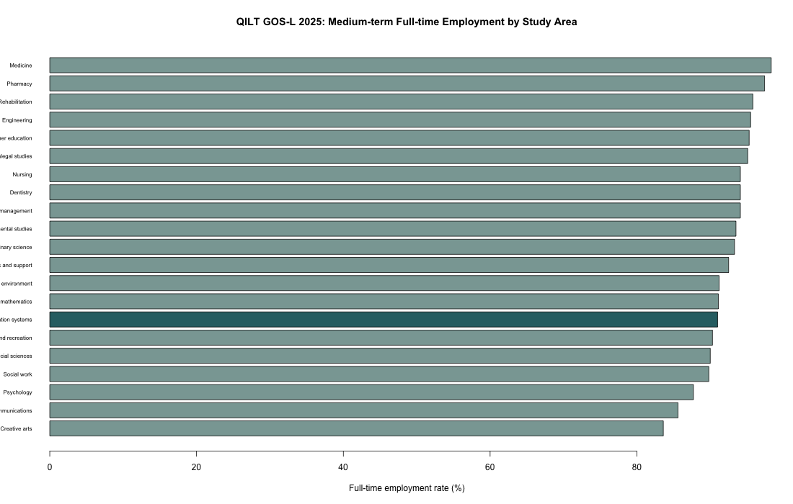
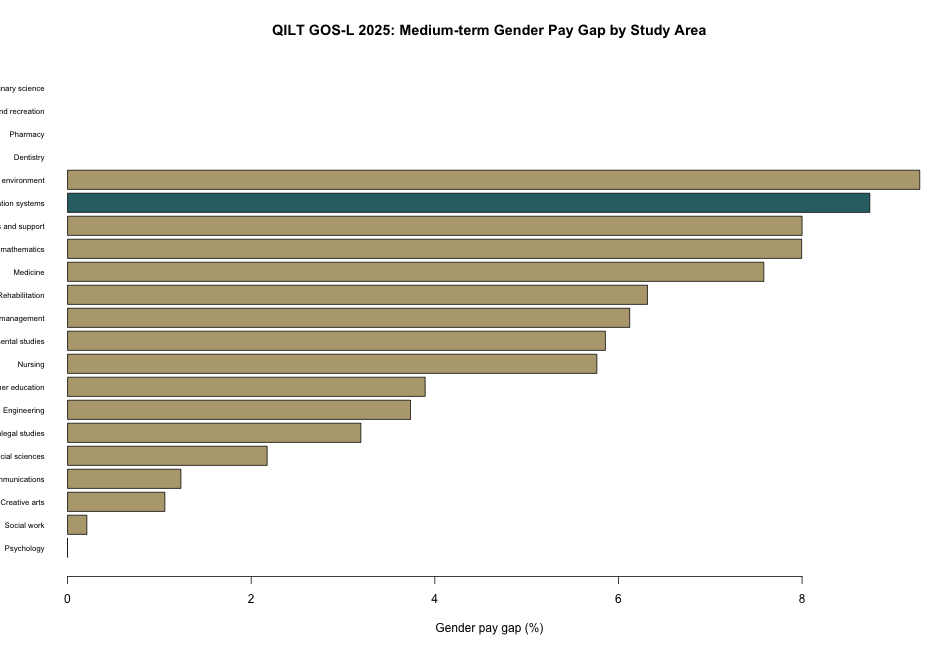
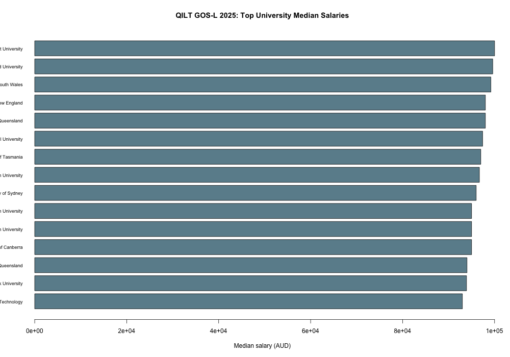
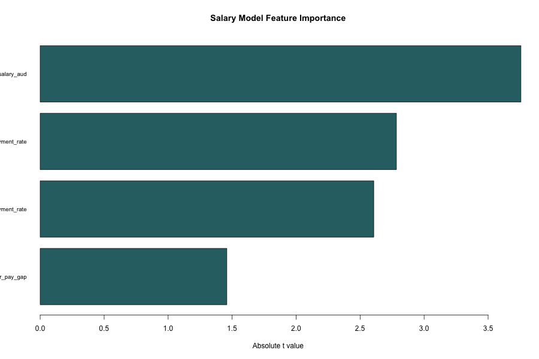

```{r setup, include=FALSE}
knitr::opts_chunk$set(echo = FALSE, warning = FALSE, message = FALSE)
```

```{r load-data}
data <- read.csv("../data/processed/qilt_gosl_2025_area_features.csv", stringsAsFactors = TRUE)
model_comparison <- read.csv("../outputs/tables/model_comparison.csv")
feature_importance <- read.csv("../outputs/tables/feature_importance.csv")
employment_by_field_year <- read.csv("../outputs/tables/employment_by_field_year.csv")
gender_pay_gap_by_field <- read.csv("../outputs/tables/gender_pay_gap_by_field.csv")
institutional_summary <- read.csv("../outputs/tables/institutional_summary.csv")
correlation_table <- read.csv("../outputs/tables/correlation_table.csv", check.names = FALSE)
cis_data <- data[data$is_cis == "Yes", ]
```

## 1. Introduction

This project analyses Australian Computing and Information Systems (CIS) graduate outcomes using real public summary data from the QILT Graduate Outcomes Survey - Longitudinal (GOS-L) 2025 National Report Tables.

The original project document focused on CIS graduate employment, salary outcomes, gender pay gaps, and institutional differences. This version keeps the same topic, but uses the latest public QILT summary tables that were available during project development.

### Research Questions

1. How do CIS graduates compare with other study areas in employment and salary outcomes?
2. What is the gender pay gap for CIS graduates compared with other study areas?
3. Which universities show strong medium-term employment and salary outcomes?

## 2. Data Source and Wrangling

The data source is the QILT GOS-L 2025 National Report Tables. GOS-L surveys graduates around three years after course completion and reports medium-term graduate outcomes.

The project uses the following extracted tables:

- study-area employment and salary summary;
- study-area and gender employment and salary summary;
- university-level medium-term full-time employment rates;
- university-level medium-term median salaries.

Because the public file is an Excel workbook with many report sheets, a small Python script extracts selected sheets into clean CSV files. The main analysis is then completed in R.

Data checking included:

- checking employment rates are between 0 and 100;
- checking salaries are positive and within a reasonable range;
- removing duplicate rows;
- creating CIS and STEM-related flags;
- calculating short-term to medium-term employment and salary growth;
- calculating gender pay gap by study area.

```{r data-overview}
overview <- data.frame(
  study_areas = nrow(data),
  cis_medium_term_full_time_employment = cis_data$medium_term_full_time_employment_rate,
  cis_medium_term_overall_employment = cis_data$medium_term_overall_employment_rate,
  cis_medium_term_salary_aud = cis_data$medium_term_median_salary_aud,
  cis_gender_pay_gap = round(cis_data$gender_pay_gap, 4)
)
overview
```

## 3. Employment Outcomes

```{r employment-plot, fig.width=9, fig.height=5}

```

```{r cis-table}
cis_data
```

The QILT 2025 data shows that CIS undergraduates had a medium-term full-time employment rate of `r cis_data$medium_term_full_time_employment_rate`% and a medium-term overall employment rate of `r cis_data$medium_term_overall_employment_rate`%. Their medium-term median salary was `r format(cis_data$medium_term_median_salary_aud, big.mark = ",")` AUD.

## 4. Gender Pay Gap

The gender pay gap is calculated as:

```text
(Male medium-term median salary - Female medium-term median salary) / Male medium-term median salary
```

```{r gender-gap-plot, fig.width=8, fig.height=5}

```

```{r gender-gap-table}
gender_pay_gap_by_field[gender_pay_gap_by_field$field_of_education == "Computing and information systems", ]
```

For CIS, male graduates had a medium-term median salary of `r format(cis_data$male_medium_salary_aud, big.mark = ",")` AUD, while female graduates had a medium-term median salary of `r format(cis_data$female_medium_salary_aud, big.mark = ",")` AUD. The calculated CIS gender pay gap is about `r round(cis_data$gender_pay_gap * 100, 1)`%.

## 5. Institutional Outcomes

```{r institution-plot, fig.width=9, fig.height=5}

```

```{r institution-table}
head(institutional_summary, 10)
```

The institutional table compares universities by medium-term full-time employment rate and median salary. Since the public workbook provides university-level summary values, this section focuses on descriptive comparison rather than individual-level modelling.

## 6. Modelling

This project uses two simple models:

- linear regression to explain medium-term median salary across study areas;
- decision tree to classify whether a study area has above-median medium-term salary.

```{r model-comparison}
model_comparison
```

The salary regression model is saved as:

```text
outputs/models/salary_regression_model.rds
```

The high-salary decision tree model is saved as:

```text
outputs/models/best_employment_model.rds
```

### Feature Importance

```{r feature-importance-plot, fig.width=8, fig.height=5}

```

```{r feature-importance-table}
feature_importance
```

## 7. Correlation Analysis

```{r correlation-table}
correlation_table
```

The correlation table shows relationships between employment rates, salary growth, median salary, and gender pay gap across study areas.

## 8. Conclusion

Using real QILT GOS-L 2025 public summary data, CIS graduates show strong medium-term employment and salary outcomes. CIS has a medium-term full-time employment rate above 90% and a median salary of 100,000 AUD, which places it among the stronger study areas in the dataset.

The gender pay gap remains visible. In CIS, the male medium-term median salary is higher than the female medium-term median salary, producing a gender pay gap of around 8.7%. This suggests that pay equity remains an important issue even in a high-demand technology-related field.

The university-level tables show that several institutions report strong medium-term employment and salary outcomes. However, because the public data is aggregated, the results should be interpreted as descriptive findings rather than individual-level causal evidence.

## 9. Limitations

This project uses official public summary tables, not confidential person-level survey records. Because of this, the project cannot model individual graduate outcomes such as personal GPA, internship history, or job search behaviour. The analysis is still useful for comparing study areas and institutions, but it should not be presented as a causal analysis.

## 10. References

Quality Indicators for Learning and Teaching. (2025). Graduate Outcomes Survey - Longitudinal National Report Tables.

Quality Indicators for Learning and Teaching. Graduate Outcomes Survey - Longitudinal. https://qilt.edu.au/surveys/graduate-outcomes-survey---longitudinal-%28gos-l%29

R Core Team. R: A language and environment for statistical computing.

